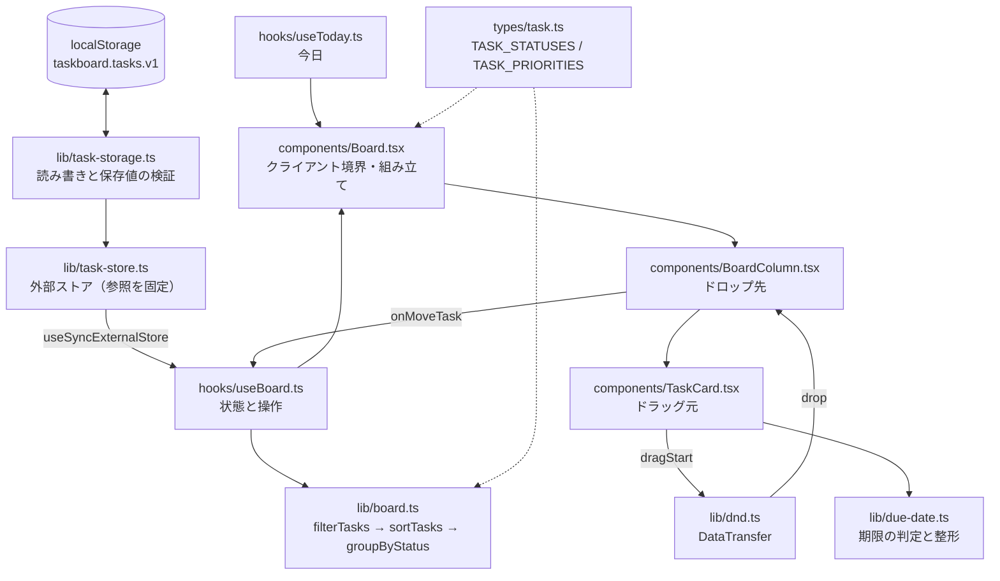

# アーキテクチャ

TaskBoard の構造と、**なぜその形になっているか**をまとめた文書です。

| 文書 | 役割 |
|---|---|
| [`README.md`](README.md) | 使い方・機能・ディレクトリ構成（**何があるか**） |
| **`ARCHITECTURE.md`**（この文書） | 主要な構成要素とその関係、設計の理由（**なぜそうなっているか**） |
| [`CLAUDE.md`](CLAUDE.md) | コードを変更するときに守る制約（**壊してはいけないこと**） |

## 全体像

依存は `lib` → `hooks` → `components` の一方向です。React に依存しない判断（並び替え・
バリデーション・仕分け・永続化）はすべて `lib/` の純粋関数に置き、`hooks/` が状態を、
`components/` が表示と DOM イベントを受け持ちます。



`src/app/page.tsx` は Server Component で、`"use client"` の境界は `Board.tsx` にあります。
`Board` 以下はサーバー側でもプリレンダリングされるため、**描画中に現在時刻や localStorage を
読めない**という制約が、後述する複数の設計判断の理由になっています。

## 主要な構成要素

各項目は「役割 / 主なエクスポート / 設計上の約束 / 依存」で揃えてあります。

### 1. `src/types/task.ts` — ドメイン型と「順序」の唯一の情報源

**役割**: `Task` / `TaskDraft` / `TaskStatus` / `TaskPriority` の定義と、列・優先度の一覧。

**主なエクスポート**: `TASK_STATUSES` / `TASK_PRIORITIES` / `TASK_STATUS_LABELS` /
`TASK_PRIORITY_LABELS` / `DEFAULT_TASK_PRIORITY` / `isTaskStatus` / `isTaskPriority`

**設計上の約束**:

- `TASK_STATUSES`（`todo` / `in-progress` / `on-hold` / `done`）の**配列の並び順が、そのまま
  画面上の列の並び順**になる。列の追加・削除・並べ替えはこの配列とラベルを直すだけで完了する
- `TASK_PRIORITIES`（`high` / `medium` / `low`）も同じで、**配列の並び順がそのまま
  「優先度の高い順」**。`sortTasks` は `TASK_PRIORITIES.indexOf(...)` で順位を求める
- ラベルは `Record<TaskStatus, string>` なので、値を増やしてラベルを足し忘れると `tsc` が捕まえる
- 型ガード `isTaskStatus` / `isTaskPriority` は画面の入力検証だけでなく、
  **保存値の復元（`task-storage.ts`）でも同じものを使い回す**

このパターンのおかげで「列の順序」「優先度の順位」を知っている場所が 1 か所に閉じています。
新しく列や優先度をハードコードする実装を足さないでください。

### 2. `src/lib/board.ts` — ドメインロジック（React 非依存）

**役割**: タスク配列に対する操作すべて。ボードの振る舞いの実体はここにあります。

**主なエクスポート**: `isValidDraft` / `createTask` / `addTask` / `moveTask` / `removeTask` /
`sortTasks` / `filterByStatus` / `groupByStatus` / `filterTasks` / `matchesFilter` /
`isFilterActive` / `collectAssignees` / `BoardFilter` / `EMPTY_BOARD_FILTER` / `TasksByStatus`

**設計上の約束**:

- **変化が無ければ同じ配列参照を返す。** `moveTask`（対象が無い / 既に移動先の列にいる）、
  `removeTask`（該当が無い）、`filterTasks`（条件が空）が該当。この参照の同一性が
  そのまま「無駄な保存と再描画をしない」に効く（→ #5）。テストも `toBe` で検証している
- **タスクは移動先の列の末尾に入る。** 状態はフラットな `Task[]` で持ち、`groupByStatus` で
  列に仕分けるため、`moveTask` は対象を配列から取り除いて末尾に付け直す
- `sortTasks` は「優先度が高い順 → 期限が近い順」。期限未設定（`""`）は常に後ろ。
  `Array.prototype.sort` は安定なので、どちらも同じタスクは追加順を保つ
- 絞り込み条件 `BoardFilter`（`query` / `assignee` / `priority`）は、**どの項目も `""` が
  「すべて」**を意味する。条件は AND で、キーワードはタイトルと説明を対象に大文字小文字を無視する
- `groupByStatus` は `TASK_STATUSES` から全キーを生成するので、**空の列も必ずキーを持つ**

### 3. `src/lib/due-date.ts` — 期限の判定と表示

**役割**: 期限文字列の正規化・期限切れ判定・表示整形。期限まわりの判断はここに閉じています。

**主なエクスポート**: `normalizeDueDate` / `getDueDateTone` / `formatDueDate` / `todayString` /
`DueDateTone` / `DUE_DATE_TONE_LABELS`

**設計上の約束**:

- 期限は `Date` ではなく **`"YYYY-MM-DD"` 文字列**で持つ。この形式は**辞書順の比較がそのまま
  日付の前後の比較**になるため、比較のために `Date` へ変換する必要がなく、タイムゾーンの
  影響も受けない。未設定は `null` ではなく `""`（`description` と同じ扱い）
- `normalizeDueDate` は `2026-02-31` のように桁は合っていても存在しない日付を `""` に倒す。
  **エラーにせず既定値へ倒す**のがこのリポジトリ共通の方針（→ #4 も同じ）
- **`lib` の中で現在時刻を読まない。** `getDueDateTone(dueDate, today)` のように「今日」は
  必ず引数で受け取る。現在時刻に触れるのは `todayString(now = new Date())` だけで、
  既定引数のおかげでテストから固定の `Date` を渡せる
- `getDueDateTone` は `today === ""` のとき `null`（＝強調なし）を返す。これが #7 の
  ハイドレーション対策の受け皿になっている

### 4. `src/lib/task-storage.ts` — 永続化の境界

**役割**: localStorage の読み書きと、保存値の検証。キー名や JSON の形を知っているのはここだけです。

**主なエクスポート**: `TASKS_STORAGE_KEY` / `readStoredTasks` / `writeStoredTasks` /
`parseStoredTasks` / `serializeTasks`

**設計上の約束**:

- `Storage` は `readStoredTasks(storage = getLocalStorage())` のように**既定引数で受け取る**。
  `todayString(now = new Date())` と同じ形で、`lib` が暗黙にグローバルを読まないようにしている
- **`null`（保存が無い）と `[]`（全部消した）を区別する。** キーが無い・JSON が壊れている・
  配列でない場合は `null` を返し、呼び出し側はそのときだけサンプルデータに倒す
- 壊れた保存値はエラーにせず既定値へ倒す。**捨てるのは `id` / `title` を欠く要素だけ**で、
  未知の `status` は先頭の列に、未知の `priority` は `DEFAULT_TASK_PRIORITY` に倒す
- 保存の失敗（容量超過・プライベートモード）でアプリを止めない。表示は続けられるため握りつぶす
- 保存形式を変えるときは `TASKS_STORAGE_KEY` の `v1` を上げる（古い保存値は読まれずサンプルに戻る）

### 5. `src/lib/task-store.ts` — `useSyncExternalStore` 用の外部ストア

**役割**: タスクの実体を保持し、React に購読させる。#4 と #6 をつなぐ層です。

**主なエクスポート**: `createTaskStore` / `TaskStore`

**設計上の約束**:

- **`getSnapshot` は毎回同じ参照を返す。** 読むたび `JSON.parse` すると毎回新しい配列になり、
  React が無限ループとして検出してエラーになる。そのため一度読んだ結果をキャッシュしている
- `getServerSnapshot` は localStorage を読まず `initialTasks` を返す。サーバー描画と
  クライアント初回描画のマークアップが必ず一致する
- **`update` は更新関数が同じ参照を返したら何もしない。** #2 の「変化が無ければ同じ配列」が
  そのまま保存と通知の抑制になる
- ストアは**モジュール共有ではなく呼び出しごとに作る**（`useBoard` の中で生成）。
  こうするとテストは `localStorage.clear()` するだけで隔離でき、リセット用の API が要らない

### 6. `src/hooks/useBoard.ts` — 状態と操作の集約

**役割**: ボードの状態（タスク・絞り込み条件）と、画面から呼ぶ操作をまとめる。

**主なエクスポート**: `useBoard` / `UseBoardResult`

**設計上の約束**:

- タスクの実体は #5 のストアで、`useSyncExternalStore` 越しに読む。
  **`useEffect` + `setState` で復元しない**（ハイドレーション不一致になるうえ、
  ESLint の `react-hooks/set-state-in-effect` にも弾かれる）
- **絞り込み条件は保存しない。** 通常の `useState` で持つ。条件を掛けたままリロードすると
  「タスクが消えた」と誤解されるため
- 表示用のデータは `filterTasks` → `sortTasks` → `groupByStatus` の順に `useMemo` で組み立てる。
  **`tasks`（フラットな配列）は追加順のまま**保たれるので、#2 の「末尾に入る」振る舞いと
  参照同一性の最適化はそのまま生きる
- 担当者の選択肢（`assignees`）は**絞り込み前**の全タスクから作る（絞り込むと選択肢が
  消えてしまうのを防ぐ）
- `addTask` はタイトルが空なら追加せず `false` を返す。エラー表示はフォーム側の責務

### 7. `src/hooks/useToday.ts` — 「今日」の供給

**役割**: 期限の判定に使う「今日」を `"YYYY-MM-DD"` で返す。

**主なエクスポート**: `useToday`

**設計上の約束**:

- **#5 と同じ問題を、同じ手段で解いている。** `Board` はサーバー側でもプリレンダリング
  されるため、描画中に現在時刻を読むとサーバーとクライアントで日付がずれてハイドレーション
  不一致になる。そこで `useSyncExternalStore` を使い、`getServerSnapshot` が `""` を返す
- `""` を受けた `getDueDateTone` は `null`（強調なし）を返すので（→ #3）、
  マークアップは必ず一致し、マウント後に強調だけが付く
- 「今日」は開いている間変わらない前提なので、`subscribe` は何も購読しない
- `Board` の `today` プロップは、統合テストが固定日を注入するための入口。
  `src/app/page.tsx` からは渡さない

### 8. `src/lib/dnd.ts` — ドラッグ＆ドロップの受け渡し

**役割**: `DataTransfer` の読み書き。コンポーネントは MIME タイプもフォールバックも知りません。

**主なエクスポート**: `TASK_DND_MIME` / `setDragTaskId` / `getDragTaskId` / `hasTaskPayload`

**設計上の約束**:

- ライブラリを使わない HTML5 ネイティブ D&D。独自 MIME `application/x-taskboard-task` と
  `text/plain` の両方に書き込み、読み取りは前者を優先する
- **ドラッグ中は `getData` が読めない**（ブラウザの保護モード）。そのため `dragover` では
  `types` だけを見る `hasTaskPayload` で判定し、`drop` で初めて `getDragTaskId` を呼ぶ
- `DataTransfer` は仕様上 `null` になり得るので、受け取り側で `null` / `undefined` を許容する

### 9. `src/components/` — 表示と DOM イベント

**役割**: 描画と入力。判断は持たず、`lib` の関数と `useBoard` のコールバックを呼ぶだけです。

| コンポーネント | 受け持ち |
|---|---|
| `Board.tsx` | `"use client"` 境界。`useBoard` と `useToday` をつなぎ、`TASK_STATUSES.map(...)` で列を描く |
| `BoardColumn.tsx` | 1 列の表示と**ドロップ先**の振る舞い。`data-drop-active` で状態を外に出す |
| `ColumnHeader.tsx` | 列名（`TASK_STATUS_LABELS`）と件数バッジ |
| `TaskCard.tsx` | 1 件の表示と**ドラッグ元**の振る舞い。`data-priority` / `data-due-tone` で状態を外に出す |
| `TaskMoveControls.tsx` | 隣の列へ移す `←` / `→` ボタン |
| `AddTaskForm.tsx` | 追加フォーム。追加できたら入力欄を初期化、できなければエラーを出す |
| `BoardFilterBar.tsx` | 検索と絞り込みの入力。条件は自分では持たず親に返す |

**設計上の約束**:

- **`←` / `→` ボタンは D&D の代替手段。** HTML5 D&D はキーボードとタッチで動かないため、
  `TaskMoveControls` が同じ `onMove` を呼ぶ。隣の列は `TASK_STATUSES.indexOf` の前後で求めるので、
  ドラッグ経路とボタン経路の順序は必ず一致する
- 列の内側（カード間）を移動しただけの `dragleave` は
  `currentTarget.contains(relatedTarget)` で無視する
- カードの状態は**色ではなく data 属性**で外に出す。テストは色ではなくこの属性を見る
- `BoardFilterBar` の外側は `section` ではなく `search` 要素。名前付きの `section` は
  `role="region"` になり、列を数えている `getAllByRole("region")` に混ざってしまう
- `BoardFilterBar` のラベルは「担当者で絞り込む」「優先度で絞り込む」。`AddTaskForm` の
  「担当者」「優先度」と同じ名前にすると `getByLabelText` が曖昧になる

## 横断する 3 つの約束

個別の構成要素にまたがる、このリポジトリ全体の設計方針です。

| 約束 | 具体例 |
|---|---|
| **順序の情報源は配列 1 本** | `TASK_STATUSES` / `TASK_PRIORITIES`。追従するのは `groupByStatus` / `sortTasks` / `Board` の列描画 / `TaskMoveControls` |
| **`lib` は現在時刻もグローバルも暗黙に読まない** | `todayString(now = new Date())` と `readStoredTasks(storage = ...)` が同じ形。テストから差し替えられる |
| **サーバーで読めない値は `useSyncExternalStore`** | `useToday`（現在時刻）と `task-store`（localStorage）が同型。`useEffect` + `setState` はハイドレーション不一致を招くうえ `react-hooks/set-state-in-effect` に弾かれる |

もう一つ通底しているのが「**壊れた入力はエラーにせず既定値に倒す**」で、
`normalizeDueDate`（不正な日付 → `""`）と `task-storage.ts` の復元（未知の列 → 先頭の列）が
同じ考え方で書かれています。

## 変更するときの入口

| やりたいこと | 触る場所 |
|---|---|
| 列を増やす・並べ替える | `types/task.ts` の `TASK_STATUSES` と `TASK_STATUS_LABELS` **だけ** |
| 優先度を増やす・並べ替える | `types/task.ts` の `TASK_PRIORITIES` と `TASK_PRIORITY_LABELS` **だけ** |
| タスクに項目を足す | `types/task.ts` の `Task` / `TaskDraft` → `createTask` → `task-storage.ts` の `toTask` → フォームとカード → `src/test/task.ts` のファクトリ |
| 新しい判断ロジックを足す | `lib/` に純粋関数として書き、hook とコンポーネントからは呼ぶだけにする |
| 保存形式を変える | `TASKS_STORAGE_KEY` の `v1` を上げる |
| 絞り込み条件を増やす | `lib/board.ts` の `BoardFilter` / `matchesFilter` / `isFilterActive` → `BoardFilterBar` |

テストはソースと同じ場所に `*.test.ts(x)` として置きます（`src/**/*.test.{ts,tsx}` のみ拾う設定）。
`Task` / `TaskDraft` のリテラルは `src/test/task.ts` の `createTestTask` / `createTestDraft` で
組み立てるので、項目が増えたときに直すのはこの 1 ファイルだけで済みます。

変更を入れたら次の順で確認します（`npm run lint` は型エラーを見ないので、型チェックを省略しない）。

```bash
npx tsc --noEmit && npm run lint && npm test && npm run build
```

より詳しい制約と「やってはいけないこと」は [`CLAUDE.md`](CLAUDE.md) にまとまっています。
